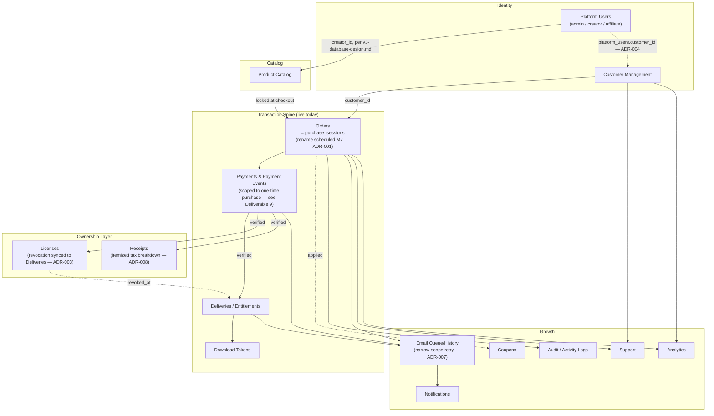

# Robayer WealthLab — Version 3.0.2 Commerce Architecture & Customer Lifecycle Blueprint

**Status: RATIFIED.** This is the official, governing architecture document for Version 3.0.2. See the Governance Statement below.

**Companion documents (all part of the same governance record):**
- [`docs/v3.0.2-arb-review-report.md`](v3.0.2-arb-review-report.md) — the independent Architecture Review Board's findings that produced this ratified revision.
- [`docs/v3.0.2-architecture-decision-register.md`](v3.0.2-architecture-decision-register.md) — the full, structured ADR record (13 decisions).
- [`docs/v3.0.2-architecture-amendment-register.md`](v3.0.2-architecture-amendment-register.md) — full traceability from every ARB finding to its resolution.
- [`docs/v3.0.2-sprint-readiness-report.md`](v3.0.2-sprint-readiness-report.md) — milestone-by-milestone readiness assessment for implementation.

**Grounding:** Every claim about the current system in this document was verified directly against the live codebase — `backend/database/schema.sql` (migrations 0001–0017), every route in `backend/routes/`, every service in `backend/services/`, and the real checkout/webhook/fulfilment code paths. Where this document builds on prior planning work, that work is cited by filename. Where this document was revised in response to independent review, the responsible ADR is cited inline.

---

## Version History

| Version | Date | Author | Reviewer | Summary of changes | Approval status |
|---|---|---|---|---|---|
| 1.0 (Original Blueprint) | Sprint 1 | Architecture function (design role) | — | Initial 11-deliverable commerce architecture blueprint: customer lifecycle, commerce architecture, database design, checkout, dashboard, security, email, trust strategy, marketplace readiness, gap analysis, roadmap. | Submitted for review — not yet approved for implementation. |
| — (ARB Review) | Sprint 1 (review pass) | Architecture function (independent panel role) | — | Twelve-phase independent review of v1.0. Verdict: **Approve with Required Amendments**. 14 prioritized amendments, 6 provisional ADRs, formal risk register, entity-by-entity data model classification. | Review complete — verdict recorded in `docs/v3.0.2-arb-review-report.md`. |
| 2.0 (This document — Ratified Architecture) | Sprint 1.5 | Architecture/Governance function | ARB (Sprint 1 review pass) | All 14 ARB-approved amendments integrated; two ARB-flagged open decisions resolved (ADR-007 email-retry scope, ADR-004 customer/creator identity bridge); new Data Governance & Compliance section; new Operational Architecture & Reconciliation section; corrected compliance citations; roadmap milestones revised with concrete acceptance criteria reflecting amendments. | **Ratified — see Governance Statement below.** |

---

## Governance Statement

This document, together with its three companion documents listed above, is now **the official architectural reference for Robayer WealthLab Version 3.0.2**. Effective immediately:

1. All Version 3.0.2 implementation work must conform to this ratified architecture. Where an implementation sprint's design questions are already answered here, they are not open for re-litigation during that sprint — see the Sprint Readiness Report for exactly what remains genuinely open versus already decided.
2. **Any deviation from a decision recorded in the [Architecture Decision Register](v3.0.2-architecture-decision-register.md) requires a new ADR, added to that register, and review before implementation** — not a silent code-level departure discovered after the fact. This applies equally to a deviation discovered to be necessary during implementation (e.g., a decision that turns out to be technically infeasible) and to a deliberate scope change.
3. This document supersedes the relevant commerce-architecture content of prior, uncommitted planning documents in `docs/` (the ~20 `v3-*.md` files) where they overlap with what's specified here. Those documents remain valid, cited source material for the marketplace/creator/affiliate schema this Blueprint builds on (see Deliverable 3 and Deliverable 9) — they are not superseded in that respect, only in the sense that *this* document is now the single point of truth for how the pieces compose.
4. Operational documentation this Blueprint's decisions affect (`docs/monitoring-and-alerting.md`, `docs/backup-and-recovery.md` — see ADR-007) must be updated to match at the milestone where the relevant code actually ships, not retroactively edited now to describe code that doesn't yet exist. This is a tracked action item, not an oversight — see the Amendment Register and Sprint Readiness Report.

---

## How to read this document

Robayer WealthLab already has a substantial, well-engineered Version 3.0 foundation and a separate, high-quality prior planning effort (`docs/v3-*.md`, ~1,200 lines) that designed the **supply side** of a future marketplace — creators, affiliates, payouts, coupons, moderation. That work is sound and this Blueprint builds on it rather than replacing it.

What this Blueprint designs is the **demand side**: who a customer *is* to this platform, how they prove ownership of what they bought, where they go to see it again, and how the business builds durable trust and repeat-purchase behavior. This is the gap that stood between Version 3.0 and a safe Paystack Live Mode cutover.

This document was independently reviewed by an Architecture Review Board (see `docs/v3.0.2-arb-review-report.md`), which returned a verdict of **Approve with Required Amendments** — the foundational shape was judged correct, and a specific, bounded set of gaps was identified and is now closed in this ratified revision. Every place this document differs from its original (v1.0) form is because of a specific ARB finding, traceable via the Amendment Register.

**Central architectural decisions this document makes and defends throughout** (each now a formal ADR — see the [Architecture Decision Register](v3.0.2-architecture-decision-register.md) for full context, alternatives, and consequences):

1. **No new `orders` table** — extend `purchase_sessions` (ADR-001), with a naming resolution scheduled at Milestone M7.
2. **Guest checkout with automatic, optional account creation after payment** — never before (ADR-002), scoped explicitly to purchase-triggered provisioning only, with no self-registration surface (ADR-006).
3. **A password is never required to receive or access a purchase** — the email-link path works forever, and license revocation is now explicitly synchronized with download-entitlement revocation (ADR-003).
4. **`customers` and `platform_users` remain permanently separate tables** (ADR-004), with an explicit, minimal bridge for a customer who later becomes a creator or affiliate.
5. **Coupons, notifications, and support are sequenced deliberately behind customer identity** (ADR-005).

---

## Executive Summary

**Where V3.0 stands today (verified, not assumed):** a real, D1-backed product catalog with a mature admin CMS (2FA-ready auth, session revocation, lockout, invites, full audit logging); a payment pipeline with correct idempotency, correct webhook security, and checkout-time metadata locking; a digital fulfilment system with genuinely good security posture (single-use, short-TTL download tokens; paid files structurally unreachable through the public media API); and a real email pipeline with delivery tracking. This is not a prototype. It is a production-grade *transaction* engine — a judgment independently re-confirmed by the Architecture Review Board, not merely self-reported.

**What it is missing is a production-grade *relationship* engine.** A customer is a row's `customer_email` column and nothing more — no login, no persisted receipt, no license record, no post-purchase support channel tied to identity, no notification system. This Blueprint closes that gap.

**What changed between the original Blueprint and this ratified version:** an independent review found the foundational design sound but identified fourteen specific gaps, two of which were rated Critical (an unresolved contradiction with this project's own documented operational policy on email retry, and a missing specification for how license revocation actually revokes download access on refund). Both are now resolved (ADR-007, ADR-003), along with the remaining twelve findings — see the Amendment Register for the complete list. No finding required reopening the core five-decision design; every amendment is an addition or clarification, not a reversal.

**Five ratified decisions an executive reader should specifically weigh in, each now a formal ADR:**

1. **Do not create a new `orders` table.** Extend `purchase_sessions` (ADR-001) — with a naming resolution now explicitly scheduled at M7, addressing the one real structural concern the ARB raised.
2. **Guest checkout stays guest checkout.** No email field on Robayer's own checkout page (ADR-002).
3. **A password is never required to receive or access a purchase**, and — new in this ratified version — **a revoked license now explicitly revokes download access too** (ADR-003).
4. **`customers` and `platform_users` remain two separate tables**, now with an explicit bridging mechanism for a customer who becomes a creator (ADR-004).
5. **Coupons, notifications, and support ticketing are sequenced deliberately behind customer identity** (ADR-005), and — new in this ratified version — **account provisioning is explicitly scoped to purchase-triggered only, with no self-registration surface**, closing a verification-loop gap the original Blueprint's reasoning didn't fully cover (ADR-006).

---

## Deliverable 1 — Customer Lifecycle Blueprint

Eighteen stages, front door to loyalty. Stages already implemented in Version 3.0 are marked **(live)**; everything else is this Blueprint's ratified design. Stage 13 and Stage 14 below were revised at ratification (ADR-013) — the original Blueprint's access-mechanism language for the confirmation page and Customer Library was a placeholder description, not a real, implementable specification; this revision replaces it with one.

### 1. Visitor **(live)**

| | |
|---|---|
| **Customer action** | Arrives via search, social, referral, or direct — lands on the homepage, a blog post, or a product page. |
| **System action** | Serves the public static site + live D1-backed product data. No identity exists yet; nothing is written. |
| **UX goal** | Immediate legibility — what this platform is, that it's real and current. |
| **Security** | None yet — public, unauthenticated, read-only. |
| **Failure scenarios** | Slow load, unclear value proposition → bounce before Discovery. |
| **Recovery** | None needed; performance/SEO and trust signals (Deliverable 8) are what prevent the bounce, not a recovery mechanism after it. |

### 2. Product Discovery **(live)**

| | |
|---|---|
| **Customer action** | Browses `/books/`, blog, or Investment Centre content. |
| **System action** | Server-rendered route reads live `products` (status=`active`), renders with real SEO metadata. |
| **UX goal** | Clear categorization, honest "coming soon" states. |
| **Security** | Public read; `deleted_at`/`status` filtering already prevents draft/archived content leaking into listings. |
| **Failure scenarios** | A product with zero published assets is browsable but not deliverable — logged (`fulfilment.no_published_assets`), a content gap not a system failure. |
| **Recovery** | None needed at this stage. |

### 3. Product Evaluation **(live)**

| | |
|---|---|
| **Customer action** | Reads the product detail page. |
| **System action** | Renders live price/description — never cached stale. |
| **UX goal** | Answer "is this worth my money" without requiring an account. |
| **Security** | Public read only. |
| **Failure scenarios** | Price/description ambiguity → hesitation. |
| **Recovery** | None — a conversion problem, not a system-failure problem. |

### 4. Checkout **(live — see Deliverable 4 for the full, ratified design)**

| | |
|---|---|
| **Customer action** | Clicks Buy. No form on Robayer's own site. |
| **System action** | `POST /api/checkout/sessions` locks price/title/version, creates a `purchase_sessions` row (`status='pending'`), redirects to Paystack. |
| **UX goal** | Zero-field checkout — already implemented. |
| **Security** | Price/product identity server-locked, never trusted from the client on any later step. |
| **Failure scenarios** | Rate-limited, invalid product slug. |
| **Recovery** | Immediate, actionable error — no dead end. |

### 5. Customer Information Collection **(live — see Deliverable 4)**

| | |
|---|---|
| **Customer action** | On Paystack's own hosted page, enters email + payment details — never on a Robayer-branded form. |
| **System action** | Paystack collects and later echoes a **provider-confirmed** email; never trusted from the client. |
| **UX goal** | Collect the minimum, once, on the page best equipped to collect it securely. |
| **Security** | A provider-confirmed email at the moment of a successful charge is a real, meaningful identity signal — this is also the load-bearing fact behind ADR-006's decision not to add a redundant verification loop for this specific path. |
| **Failure scenarios** | Customer mistypes email on Paystack's page — outside this platform's control. |
| **Recovery** | Support (stage 16), with the purchase reference, for a human-verified correction. |

### 6. Pending Order Creation **(live)**

| | |
|---|---|
| **Customer action** | None — happens the instant Buy is clicked. |
| **System action** | `purchase_sessions` row inserted, `status='pending'`, `expires_at` set. |
| **UX goal** | Invisible — exists for system integrity, not customer experience. |
| **Security** | The record every later verification step reconciles against. |
| **Failure scenarios** | Customer closes the tab before completing payment. |
| **Recovery** | Session simply expires — no customer-facing consequence, since they were never charged. |

### 7. Payment **(live)**

| | |
|---|---|
| **Customer action** | Completes payment on Paystack's hosted page. |
| **System action** | Paystack processes the charge; redirects the browser *and* independently sends a server-to-server webhook — only the webhook is trusted. |
| **UX goal** | Customer never leaves a trusted payment context until genuinely resolved. |
| **Security** | Card/mobile-money data never touches Robayer's own servers. |
| **Failure scenarios** | Card declined, insufficient funds, customer cancels. |
| **Recovery** | Callback page reflects failed/cancelled state; the product page remains available to retry from scratch — no broken half-state. |

### 8. Payment Verification **(live — a genuine strength)**

| | |
|---|---|
| **Customer action** | Waits, typically sub-second, on the callback page. |
| **System action** | Webhook signature verified against the raw body; `payment_transactions` row inserted (idempotent, `paystack_reference UNIQUE`); locked metadata cross-checked; `purchase_sessions.status` transitions to `verified` only if every check passes. |
| **UX goal** | The customer never distinguishes a 200ms verification from a 2-second one — a calm "confirming your purchase" state, never a raw spinner. |
| **Security** | The single most important trust boundary in the system — nothing downstream is ever granted from anything but this verified state. |
| **Failure scenarios** | Invalid signature (rejected, retried); metadata mismatch (rejected, logged for investigation). |
| **Recovery** | A metadata-mismatch rejection routes to manual investigation via Support (stage 16). |

### 9. Purchase Confirmation **(live, UX-extended — see stage 13 for the ratified access model)**

| | |
|---|---|
| **Customer action** | Sees confirmation: purchase confirmed, what they bought, what happens next. |
| **System action** | `getFulfilmentStatus()` returns a customer-safe status (`processing`/`ready`/`unavailable` — never internal state names). |
| **UX goal** | The single highest-trust moment in the relationship — must feel like a receipt from a real company (Deliverable 8). |
| **Security** | Status vocabulary deliberately coarsened before it reaches the browser. See stage 13/ADR-013 for the ratified distinction between *viewing* this page and *acting* from it. |
| **Failure scenarios** | Customer refreshes before webhook processing completes → sees `processing`, not an error. |
| **Recovery** | Safely re-visitable at any point via `purchaseReference` in the URL — no destructive re-submission risk. |

### 10. Receipt Generation **(new — see Deliverable 3, `receipts`)**

| | |
|---|---|
| **Customer action** | None required. |
| **System action** | The moment `purchase_sessions.status` becomes `verified`, a `receipts` row is created: sequential receipt number, snapshotted line-item breakdown, **itemized tax breakdown** (ADR-008 — ratified in this revision, replacing the original single-`tax_pesewas`-field design), the data needed to regenerate an identical PDF on demand. |
| **UX goal** | Reads like it came from a real, VAT-aware Ghanaian business (Deliverable 8). |
| **Security** | Snapshotted at issuance — a later price or tax-rate change never rewrites a past receipt. |
| **Failure scenarios** | Receipt-number generation collides under concurrency. |
| **Recovery** | Same proven insert-and-retry pattern `purchase_reference` generation already uses. |

### 11. License Creation **(new — see Deliverable 3, `licenses`)**

| | |
|---|---|
| **Customer action** | None required at purchase time; later visible/downloadable as a certificate. |
| **System action** | One `licenses` row per (order, product, seat) — see ADR-009 on the ratified seat-cardinality model for `order_items.quantity > 1`. |
| **UX goal** | Concrete answer to "never feel like buying just a PDF." |
| **Security** | The license key is never a bearer credential for access — access stays gated by `deliveries`/download tokens, kept deliberately separate. |
| **Failure scenarios** | License generation fails after payment succeeded. |
| **Recovery** | Never blocks delivery — mirrors `fulfilmentService.ts`'s existing philosophy exactly; the download still works even if license-record creation needs a retry. |

### 12. Secure Download **(live — a genuine strength)**

| | |
|---|---|
| **Customer action** | Clicks Download. |
| **System action** | Mints a single-use, short-TTL token; redeems exactly once; streams from R2 with a professionally-derived filename (fixed this cycle — see `docs/flagship-toc-and-filename-audit.md`). **Token issuance now explicitly checks `deliveries.status != 'revoked'`** (ADR-003), regardless of which surface requests it. |
| **UX goal** | Fast, reliable, professionally-named file. |
| **Security** | 256-bit tokens, single-use, rate-limited, R2 object never reachable via any other public route. |
| **Failure scenarios** | Token expired, already used, download-limit reached, entitlement revoked (new), object genuinely missing. |
| **Recovery** | Every failure mode returns a specific, actionable, non-alarming message; a fresh token can always be minted while `deliveries.max_downloads` and `status` permit it. |

### 13. Customer Library **(new — access model ratified per ADR-013)**

| | |
|---|---|
| **Customer action** | Returns to the site, wants to see everything they've bought. |
| **System action** | Dashboard "My Library" page (see Deliverable 5) queries `orders`/`licenses`/`deliveries` by `customer_id`. |
| **UX goal** | The single biggest gap this Blueprint closes. |
| **Security — ratified access model (ADR-013):** | **Viewing** a specific purchase's confirmation/status/receipt is accessible by `purchaseReference` alone, unchanged from today's live behavior — a deliberately shareable, bookmarkable, deep-linkable URL, consistent with standard confirmation-page UX. **The full Library (all purchases across an identity) and any action** (re-issuing a download token from the dashboard, account changes) require an authenticated `customer_sessions` session. There is no in-between "session-ish, URL-freshness-based" access tier — the original Blueprint's description of one was a placeholder, not a specification, and this revision replaces it with the above, precise, two-tier model. |
| **Failure scenarios** | Customer has no account yet, or opted out of setting a password. |
| **Recovery** | The original email-link download path continues to work forever, unconditionally — the Library is additive, never a replacement that could strand an existing customer. |

### 14. Account Creation **(new — scope ratified per ADR-006)**

| | |
|---|---|
| **Customer action** | Nothing required; optionally sets a password from a prompt on the confirmation page or the welcome email. |
| **System action** | The instant a purchase verifies, the system finds-or-creates a `customers` row keyed on the provider-confirmed email — automatically, silently, with no password yet. |
| **UX goal** | A *side effect* of a successful purchase, never a *precondition* for one. |
| **Security — ratified scope (ADR-006):** | **Account creation happens only via this purchase-triggered path in Version 3.0.2. There is no public "Sign Up" registration surface anywhere in this scope** — the original Blueprint gestured at an optional future "sign in before shopping" link without resolving what that would imply for verification; this revision closes that ambiguity explicitly. An account with no password set cannot be logged into by anyone. |
| **Failure scenarios** | Customer never sets a password, ever. |
| **Recovery** | Fully fine — every purchase remains accessible via the email-link path indefinitely. |

### 15. Future Purchases **(new/extended)**

| | |
|---|---|
| **Customer action** | Buys a second product, logged in or as a guest with the same email. |
| **System action** | The same find-or-create-by-email logic from stage 14 *finds* the existing `customers` row instead of creating a second one. |
| **UX goal** | A logged-in returning customer experiences genuinely faster checkout via Paystack's own card tokenization. |
| **Security** | Provider-confirmed email remains the durable join key across purchases. |
| **Failure scenarios** | Customer used a different email on purchase two. |
| **Recovery** | Two separate `customers` rows result — an accepted, honest limitation (see the Risk Register); account merging is explicitly a deferred V3.1+ item. |

### 16. Support **(new)**

| | |
|---|---|
| **Customer action** | Opens a support request referencing their order. |
| **System action** | A `support_requests` row, tied to `customer_id` and (when applicable) `purchase_session_id` — deliberately distinct from `consultation_requests`/`contact_messages`, which remain pre-sale lead-generation forms. |
| **UX goal** | A support request that already knows what was bought feels like a company with its records together. |
| **Security** | Only the owning customer (or staff) can view a `support_requests` row. |
| **Failure scenarios** | Customer has no account and needs support. |
| **Recovery** | Support requests remain submittable by email + purchase reference alone, unauthenticated, exactly as `consultation_requests` works today. |

### 17. Product Updates **(new/future)**

| | |
|---|---|
| **Customer action** | Receives a "new version available" notification. |
| **System action** | `product_files.version` (already live) triggers a notification via `notification_queue`/`emailService` on a deliberate "publish new version" action, not every minor edit. |
| **UX goal** | "You own the current edition," a real trust-builder for a book/guide. |
| **Security** | Notification-only, never re-grants access. |
| **Failure scenarios** | Notification fails to send. |
| **Recovery** | The updated file is still reachable from the Library regardless of notification success. |

### 18. Retention → Loyalty → Repeat Purchase **(new/future)**

| | |
|---|---|
| **Customer action** | Opens marketing/product emails over time, eventually buys again. |
| **System action** | `newsletter_subscribers`/`newsletter_campaigns` (already live) is the natural retention channel; `customers` gives it a stronger join key once accounts exist. |
| **UX goal** | Genuine ongoing value, never manufactured urgency or fake scarcity — consistent with this platform's stated anti-fabrication design philosophy. |
| **Security** | Existing `unsubscribe_tokens` consent mechanics apply unchanged. |
| **Failure scenarios** | Customer never returns. |
| **Recovery** | Not a system failure — a content/offer-quality outcome, not an architecture concern. |

---

## Deliverable 2 — Commerce Architecture

### Module map

### Module-by-module reasoning

| Module | Backing table(s) | Status | Why it exists / architectural reasoning |
|---|---|---|---|
| **Customer Management** | `customers`, `customer_profiles` | New | Split deliberately: `customers` holds only what authentication and ownership require; `customer_profiles` holds soft/mutable/marketing-adjacent data. Provisioning is scoped to purchase-triggered only (ADR-006). |
| **Product Catalog** | `products`, `product_files`, `product_gallery`, `product_relations` | Live, unchanged | Already correctly modeled. |
| **Orders** | `purchase_sessions` (extended) | Live + extended | Not a new table (ADR-001) — naming resolution scheduled at M7. |
| **Order Items** | `order_items` (new) | New | `quantity` represents distinct license-seat cardinality (ADR-009), not a shared license. |
| **Payments** | `purchase_sessions` fields | Live, unchanged | **Ratified caveat, added at this revision:** this decision is scoped specifically to `pricing_model = 'one-time'`. The moment a subscription product exists (explicitly future scope, Deliverable 9), "one payment's worth of fields on one order row" no longer holds — a subscription is one order-ish concept with many payments over its lifetime, and this decision will need a genuinely separate `payments`/`subscription_charges` table at that point, not a reuse of this pattern. This caveat did not exist in the original Blueprint; the ARB flagged its absence as a real future-compatibility gap. |
| **Payment Events** | `payment_transactions` | Live, unchanged | Already an append-only, idempotent gateway-event ledger — this *is* the audit-grade payment-events log. |
| **Licenses** | `licenses` (new) | New | Revocation now explicitly synchronized with `deliveries.status` (ADR-003). |
| **Receipts** | `receipts` (new) | New | Now includes `tax_breakdown` (ADR-008). |
| **Invoices** | *(not built — deliberate)* | Deferred | Every purchase is paid upfront; no accounts-receivable concept exists yet. A genuine future addition once institutional pay-later purchasing exists. |
| **Downloads / Download Tokens** | `deliveries`, `download_tokens` | Live, unchanged | Already strong; token issuance now explicitly checks revocation status (ADR-003). |
| **Coupons / Promotions** | `coupons`, `coupon_redemptions` | Designed on paper (`docs/v3-database-design.md`), not yet in production | Adopted directly. `first_purchase_only`'s known, accepted weakness against multi-account abuse is documented in the Risk Register, not silently assumed solved. |
| **Notifications** | `notification_queue` (new) | New | Distinct from email; every trigger writes to both. Granular per-type preferences explicitly deferred to V3.1+. |
| **Email Queue / History** | `email_log` | Live, unchanged | Both a queue and a history already. Automated retry is now explicitly scoped narrow (ADR-007) — see Operational Architecture below. |
| **Support** | `support_requests`, `support_notes` | New | Distinct from pre-sale `consultation_requests`/`contact_messages`. |
| **Audit Logs** | `audit_logs` | Live, unchanged | `actor_type` already includes `'customer'`. |
| **Activity Logs** | `activity_logs` (new) | New | Lighter-weight, customer-visible, distinct retention from `audit_logs`. |
| **Analytics** | Derived, no new write-path table | Extended | A read concern over the transaction spine. |
| **Referral readiness** | `purchase_sessions.affiliate_product_link_id` (from `docs/v3-database-design.md`) | Designed on paper | Directly reused. |
| **Future subscriptions** | Deliberately no schema today | Explicitly deferred | `products.pricing_model` stays `'one-time'`-only — see this section's Payments caveat above for the specific future-compatibility implication now made explicit. |

---

## Deliverable 3 — Production Database Architecture

Entities marked **(existing)** are unchanged from the live schema. New/revised entities below reflect every relevant ARB-approved amendment; see the [Amendment Register](v3.0.2-architecture-amendment-register.md) for full traceability.

### `customers` (new)

- **Purpose:** the customer-facing identity. Deliberately minimal.
- **Primary fields:** `id`, `email UNIQUE NOT NULL`, `password_hash` (nullable), `email_verified_at`, `status`, `created_at`, `updated_at`, `deleted_at`.
- **Provisioning scope (ADR-006, ratified this revision):** rows are created *only* via purchase-triggered find-or-create at payment verification. No self-registration code path is in scope for Version 3.0.2.
- **Relationships:** referenced by `purchase_sessions.customer_id`, `licenses.customer_id`, `support_requests.customer_id`, `customer_profiles.customer_id` (1:1), `customer_sessions.customer_id`, and (future, M7) `platform_users.customer_id` (ADR-004).
- **Indexes:** `UNIQUE(email)`; index on `status`.
- **Security:** PBKDF2-SHA256, mirroring `admin_users`. Nullable `password_hash` means an account with no password is unauthenticateable by construction.
- **Expected growth:** the primary growth driver of the schema — "thousands of customers."
- **Retention:** soft-delete for account-closure requests, per the Data Governance & Compliance section below.
- **Future compatibility:** MFA (`totp_secret`, mirroring `admin_users`), SSO/OAuth (future `customer_oauth_identities` table).

### `customer_profiles` (new) — unchanged from v1.0

1:1 with `customers`, holding non-authentication-critical profile data (display name, country, marketing preferences, avatar). No secrets. Deleted alongside its `customers` row.

### `customer_sessions` (new) — unchanged from v1.0

Direct mirror of `admin_sessions`: token, CSRF secret, sliding expiry with absolute cap, revocable. No new security primitive introduced.

### `orders` = `purchase_sessions` (existing, extended)

- **Purpose:** unchanged — the order-of-record, created at Buy-click, through verification, to fulfilment.
- **Naming (ADR-001, ratified this revision):** the table's live name (`purchase_sessions`) will be reconciled with its true role as a permanent financial/marketplace record at Milestone M7, when the marketplace columns from `docs/v3-database-design.md` land anyway. Not resolved now — the ARB's review found reintroducing a second table disproportionate to the naming benefit at current scale, but scheduling the resolution rather than leaving it open-ended is itself the ratified decision.
- **New field:** `customer_id INTEGER REFERENCES customers(id)`, nullable.
- **Indexes:** `idx_purchase_sessions_customer` (new).
- **Future compatibility:** composes cleanly with `docs/v3-database-design.md`'s proposed columns — see the Payments caveat in Deliverable 2 for the one identified limit on this composability (subscriptions).

### `order_items` (new)

- **Purpose:** line items per order — enables bundles and multi-product/multi-seat orders.
- **Primary fields:** `id`, `purchase_session_id`, `product_id`, `product_title` (snapshotted), `unit_price_pesewas` (snapshotted), `quantity`, `asset_id` (nullable).
- **Quantity semantics (ADR-009, ratified this revision):** `quantity = N` means fulfilment generates **N distinct `licenses` rows and N independent `deliveries` entitlements** — each seat is an independently revocable grant, not one shared license with a seat count. This was ambiguous in the original Blueprint; the ARB flagged it directly, and this revision resolves it.
- **Relationships:** `purchase_session_id` → `purchase_sessions`; `product_id` → `products`.
- **Indexes:** `idx_order_items_session`, `idx_order_items_product`.
- **Security:** snapshotted pricing, same discipline as the rest of the schema.
- **Retention:** never deleted.
- **Future compatibility:** direct enabler of bundles (Deliverable 9); seat-cardinality model directly supports institutional bulk licensing once that feature is built (the *data model* is ready now; the seat-distribution UX is separately deferred).

### `licenses` (new)

- **Purpose:** customer-facing, printable proof of ownership — deliberately separate from `deliveries` (access-control).
- **Primary fields:** `id`, `purchase_session_id`, `product_id`, `customer_id`, `license_key`, `license_type` (`personal` today; extensible), `terms_version`, `issued_at`, `revoked_at`.
- **Revocation synchronization (ADR-003, ratified this revision):** any process setting `revoked_at` (refund approval, chargeback — see ADR-010) **must, in the same operation, set the corresponding `deliveries.status = 'revoked'`**. This was unspecified in the original Blueprint and is the single Critical finding this revision closes.
- **Relationships:** `purchase_session_id` → `purchase_sessions`; `product_id` → `products`; `customer_id` → `customers`.
- **Indexes:** `UNIQUE(license_key)`, `idx_licenses_customer`, `idx_licenses_purchase_session`.
- **Security:** the license key is explicitly never a bearer credential for access.
- **Retention:** never deleted; `revoked_at` (not deletion) records a refund/chargeback, preserving history.
- **Future compatibility:** `license_type`/`terms_version` support corporate/team/educational licensing without a schema change.

### `receipts` (new)

- **Purpose:** persisted, regenerable proof of payment.
- **Primary fields:** `id`, `receipt_number`, `purchase_session_id`, `customer_id`, `issued_at`, `line_items` (JSON), `subtotal_pesewas`, `discount_pesewas`, **`tax_breakdown` (new field, JSON array of `{ label, rate_percent, amount_pesewas }` — ADR-008, ratified this revision)**, `tax_pesewas` (retained as a derived sum, for quick display/reporting), `total_pesewas`, `tax_behavior`, `currency`.
- **Tax structure rationale (ratified this revision):** Ghana's indirect tax stack (VAT, NHIL, GETFund Levy, and other levies) is multi-layered, not a single flat rate, for a VAT-registered business. A single `tax_pesewas` field, as originally designed, cannot represent a compliant itemized breakdown. `tax_breakdown` is added now, before any receipt is issued under this schema, since retrofitting it onto live receipt data later would be materially more expensive. **Open item, not resolved by this architecture:** whether this business is VAT-registered, and therefore what `tax_breakdown` should actually contain at population time, is a factual business question this document cannot answer — see the Sprint Readiness Report for this as a tracked prerequisite.
- **Relationships:** `purchase_session_id` → `purchase_sessions` (1:1); `customer_id` → `customers`.
- **Indexes:** `UNIQUE(receipt_number)`, `idx_receipts_customer`, `idx_receipts_purchase_session`.
- **Retention:** never deleted — a financial/regulatory record.

### `deliveries` / `download_tokens` (existing, unchanged) — with one addition

Already excellent, fully reused. **Ratified addition:** download-token issuance must check `deliveries.status != 'revoked'` (ADR-003) — a one-line addition to the existing entitlement-check logic, not a redesign.

### `coupons` / `coupon_redemptions` (designed on paper, adopted here — unchanged from v1.0)

Adopted directly from `docs/v3-database-design.md`. **Ratified note, not a schema change:** `first_purchase_only`'s weakness against a customer creating multiple accounts under different emails to bypass it is a known, accepted risk — see the Risk Register — not a defect requiring a fix before this feature ships.

### `notification_queue` (new) — unchanged from v1.0

In-app/dashboard notifications, distinct from email. Granular per-type opt-out preferences are explicitly deferred to V3.1+ (not built in this scope).

### `support_requests` (new) — unchanged from v1.0

Post-purchase support, tied to `customer_id`/`purchase_session_id`, deliberately distinct from pre-sale `consultation_requests`/`contact_messages`.

### `audit_logs` (existing) / `activity_logs` (new) — unchanged from v1.0

`audit_logs` already correctly includes `'customer'` as a valid `actor_type`. `activity_logs` is the lighter-weight, potentially customer-visible, separately-retained sibling.

### Future entities (deferred, unchanged from v1.0)

`wishlist_items`, `product_reviews` — correctly deferred, no schema built now.

### Future entities (designed on paper, adopted by reference — extended)

`platform_users`, `affiliate_product_links`, `affiliate_clicks`, `payouts`, `product_moderation_log`, `refund_requests` — fully designed in `docs/v3-database-design.md`. **Ratified addition at this revision:** `platform_users` gains a nullable `customer_id` column at M7 (ADR-004), bridging a customer who becomes a creator or affiliate without merging the two identity tables. The rename itself (`admin_users` → `platform_users`) requires an explicit, reviewed migration/rollback plan as an M7 entry condition (ADR-011) — not merely the schema diff already designed.

---

## Deliverable 4 — Checkout Architecture

### The ratified flow, end to end

1. **Product page → "Buy Now."** Unchanged. No form.
2. **`POST /api/checkout/sessions`.** Unchanged.
3. **Redirect to Paystack's hosted checkout.** Unchanged.
4. **Payment completes; webhook fires.** Unchanged verification pipeline.
5. **Automatic customer provisioning**, inside the same verification transaction: find `customers` by the provider-confirmed email; if none exists, create one (`password_hash = NULL`, `email_verified_at` set immediately, per the reasoning in stage 5's security note). **Ratified scope boundary (ADR-006): this is the only path by which a `customers` row is ever created in Version 3.0.2. No public registration surface exists.**
6. **Order artifacts created:** `order_items`, `licenses` (one per seat, per ADR-009), `receipts` (with `tax_breakdown`, per ADR-008) — never blocking fulfilment, same retryable, logged-not-thrown discipline `fulfilmentService.ts` already uses.
7. **Fulfilment, unchanged.** `deliveries` granted, existing emails sent.
8. **Welcome/account email**, sent only for a newly-created `customers` row: explicitly optional framing, sent once (see Deliverable 5/7 for the ratified frequency specification — repeated prompting was flagged by the ARB as undermining the low-pressure trust goal).
9. **Confirmation page**, with the ratified access model from stage 13 (ADR-013): viewable by reference alone; any action requires a session or a fresh single-use action token.
10. **Customer Library access:** immediately available for *viewing* via the confirmation page; full Library and any *action* requires the account (now or later, via the welcome email at any future date).

### Why guest-first, auto-provisioned-after beats forced pre-payment registration

Unchanged from v1.0 — independently re-confirmed by the ARB as the strongest single decision in the architecture, with no defensible alternative found:

1. Every additional pre-payment field measurably reduces conversion.
2. Paystack's hosted page already collects identity better than a custom form could.
3. An auto-provisioned account is strictly more valuable — guaranteed linked to a real completed transaction, zero extra customer effort.

The one legitimate objection this document must now answer explicitly, since ADR-006 narrows the original's "future, optional sign-in" gesture: **a customer cannot create an account before ever purchasing in this scope.** This is a deliberate, ratified boundary (ADR-006), not an oversight — self-registration is a distinct future feature requiring its own independent email-verification design, not an extension of purchase-triggered provisioning's logic.

---

## Deliverable 5 — Customer Dashboard Architecture

Builds on `docs/v1.1-customer-dashboard-concept.md`'s "show only what's real" philosophy.

| Page | Purpose | Displayed information | Primary actions | User expectations | Future scalability |
|---|---|---|---|---|---|
| **My Library** | Entry point — every product owned. | Product title, cover, purchase date, download availability. | Download; view license; view receipt. | **Ratified empty state (AR-009):** a customer with zero purchases sees an honest, helpful message with a clear next action ("Nothing here yet — browse products"), never a blank screen — directly required by the UI/UX Pro Max skill's own Feedback/Empty States guidance, flagged by the ARB as previously unspecified. | Scales to bundles and multi-seat orders (ADR-009) with no redesign. |
| **Purchase History** | Chronological transaction record. | Order date, product(s), amount, status. | View order detail; request support. | Single-purchase customer sees one honest row. | Accommodates coupons/multi-item orders already. |
| **Receipts** | Financial/proof-of-payment record. | Receipt number, itemized amount, **itemized tax breakdown (ADR-008)**. | Download PDF; email a copy. | Reads like a receipt from a real, VAT-aware business. | Multi-currency-ready structurally. |
| **Licenses** | Ownership/usage-rights record. | License key, license type, product, terms version, issue date, status (active/revoked). | View/print certificate; view terms text. | A genuine "I own this" artifact. | `license_type` extensible to commercial/team/educational. |
| **Downloads** | Direct re-download access. | Per-asset filename, format, size, remaining downloads, expiry — plain language, no manufactured urgency. | Download (mints a fresh token). | Never more restrictive than the email link. | Unaffected by catalog scale. |
| **Account Security** | Password, sessions, future MFA. | Email, password-last-changed date, active sessions. | Change password; log out other sessions; **ratified: both require an explicit confirmation step (AR-009)**, per the UI/UX Pro Max skill's Interaction/Confirmation Dialogs guidance for irreversible-adjacent actions, flagged by the ARB as previously unspecified. | Should feel as trustworthy as a bank's account-security page. | TOTP column already reserved; SSO/OAuth slot in without redesign. |
| **Support** | Post-purchase help, order-aware. | Open/past requests, status, staff replies. | Open new request (pre-filled with order context); reply. | Never re-explain what was purchased. | Scales to full ticketing without a schema change. |
| **Notifications** | In-app notification center. | Unread/read, type, timestamp, link. **Ratified empty state (AR-009):** an honest "nothing yet" state for a first-time visitor. | Mark read; click through. | Never duplicates or contradicts the equivalent email. | Absorbs any future trigger type. Per-type preference granularity explicitly deferred to V3.1+. |
| **Profile** | Minimal utility-account info. | Name, email, country, marketing preferences. | Edit profile; manage newsletter subscription. | Lightweight — not a social profile. | `customer_profiles`' separation from `customers` allows growth without touching the auth-critical table. |
| **Future: Wishlist, Reviews, Recommendations** | Deferred, unchanged from v1.0. | — | — | — | Trivial additions once `customers` exists and real purchase volume justifies them. |

**Ratified addition to this section — welcome-email/password-prompt frequency (responds to the ARB's Phase 5 conversion-optimization finding):** the optional password-set prompt is shown once, in the welcome email, at first purchase. It is never re-sent as a full email on a subsequent purchase by the same still-guest customer — instead, a small, dismissible, passive reminder may appear on the confirmation page for a repeat guest purchase. Repeated full-strength prompting risks reading as pressure, which would undermine the low-friction trust goal this entire checkout design is built around.

---

## Deliverable 6 — Security Architecture

The governing principle, unchanged: **every security mechanism a customer-facing feature needs, this codebase has already built once, correctly, for admin auth** — this section extends those proven patterns rather than inventing parallel ones.

| Concern | Design | Ratified changes at this revision |
|---|---|---|
| **Authentication** | `customer_sessions`, mirroring `admin_sessions`. | None — confirmed sound. |
| **Authorization** | Object-level, session-derived `customer_id` filtering. | None — confirmed sound. |
| **Customer identity** | Provider-confirmed email at first purchase. | **Scope boundary added (ADR-006):** this identity model is validated for the purchase-triggered path specifically; a self-registration path is explicitly out of scope until it has its own verification design. |
| **Confirmation-page access** | — | **New, ratified (ADR-013):** viewing by `purchaseReference` alone; any action requires session or single-use action token. Closes an exposure the original Blueprint's underspecified "session/URL freshness" language left open. |
| **Payment verification** | Unchanged, already excellent. | None. |
| **Download authorization** | Single-use, short-TTL tokens. | **Extended (ADR-003):** token issuance now explicitly checks `deliveries.status != 'revoked'`. |
| **Token generation / expiration / replay protection** | Reuses the one proven 256-bit generator and single-use-token pattern throughout. | None. |
| **Shared links** | Download links remain single-use-per-mint. | Confirmation-page sharing risk now explicitly addressed separately (see above) rather than conflated with download-link sharing. |
| **Session security** | Mirrors `admin_sessions` exactly. | None. |
| **Email verification** | Not needed for the purchase-triggered path (payment itself is the signal). | **Scope boundary clarified (ADR-006):** a genuinely new verification loop is required only if (a) self-registration is ever built, or (b) a customer changes their account email post-purchase — neither is in this scope's provisioning path. |
| **Password recovery** | Mirrors `password_reset_tokens`. | None. |
| **Audit logging** | Extends `audit_logs`, `actor_type='customer'` already valid. | None. |
| **Rate limiting** | Reuses existing middleware. | None. |
| **Chargeback handling** | — | **New, ratified (ADR-010):** a chargeback-class webhook event triggers the same revocation operation as a refund (license + entitlement), with `reason='chargeback'` distinguishing it in record-keeping. Entirely absent from the original Blueprint. |
| **Future MFA / SSO / OAuth** | `totp_secret` pre-provisioned; identity table structurally OAuth-ready. | None. |
| **Future API readiness** | Not addressed — correctly deferred. | Confirmed as an explicit future scoping trigger, not a current gap, per ARB Phase 6. |
| **Fraud detection** | No broad fraud-scoring system; the coupon multi-account weakness is the one named vector. | Confirmed as an accepted, documented risk (Risk Register), consistent with this project's existing marketplace-side fraud-tooling deferral philosophy. |

---

## Deliverable 7 — Email Architecture

Every email reuses the existing `emailService.sendEmail()` + `email_log` pipeline — no second email system.

| Email | Purpose | Trigger | Timing | Required data |
|---|---|---|---|---|
| **Purchase confirmation / receipt** *(live)* | Confirm the charge, what was bought. | `purchase_sessions.status → verified`. | Immediate. | `purchaseReference`, `productTitle`, `amount`, `receiptNumber`. |
| **Download ready** *(live, `secure-download`)* | Deliver the access link. | Same trigger. | Immediate. | `fulfilmentUrl`. |
| **Welcome / account created** *(new)* | Introduce the auto-created account, optionally. | First-ever purchase under a new email. | Immediate, sent once only — see Deliverable 5's ratified frequency spec. | `email`, a password-set token. |
| **Password creation** *(new)* | Deliver the password-set link. | Customer clicks "Set a password." | Immediate. | Password-set token. |
| **Password reset** *(new)* | Account recovery. | Customer requests it. | Immediate. | Reset token (30-min TTL). |
| **Email verification** *(new)* | Confirm a *changed* account email — see Deliverable 6's scope note; not used for the initial purchase-triggered signup. | Customer changes account email in Account Security. | Immediate. | Verification token. |
| **Product update available** *(new)* | Notify owners of a new file version. | Deliberate "publish new version" admin action. | Batched, not per-edit. | `productTitle`, version notes. |
| **Support response** *(new)* | Notify of a staff reply. | New reply on a `support_requests` row. | Immediate. | Ticket subject, reply preview. |
| **Future: Newsletter** *(live, unchanged)* | Ongoing content/retention. | Admin-triggered. | Scheduled. | Already fully modeled. |
| **Future: Promotions** *(new, deferred to post-M4)* | Time-boxed offers. | Admin-triggered. | Scheduled. | Coupon code, expiry, eligible products. |

### Delivery reliability — ratified resolution (ADR-007)

**This is the section that changed most substantively at ratification.** The original Blueprint's Milestone M6 proposed a general Cron-Trigger-driven retry sweep over all of `email_log`, without acknowledging that this project has twice, explicitly, documented a decision against exactly this — `docs/monitoring-and-alerting.md` ("zero Cloudflare Queues, Cron Triggers, or Durable Objects anywhere... does not recommend a third-party observability platform... sufficient at this project's scale") and `docs/backup-and-recovery.md` ("no automated retry... a deliberate, documented trade-off... not a bug").

**The ratified decision (ADR-007) narrows the scope rather than reversing the prior policy wholesale:**

- A single, narrowly-scoped Cloudflare Cron Trigger — this project's first, and its only one — retries only `email_log WHERE status = 'failed' AND template IN ('purchase-receipt', 'secure-download')`, on a short interval, capped at a small number of attempts before marking `permanently_failed` and surfacing an admin-visible alert.
- **Every other email type** (newsletters, welcome, notifications, support responses) remains manually monitored, exactly as `docs/monitoring-and-alerting.md` and `docs/backup-and-recovery.md` already document — this ratified decision does not reopen that reasoning for anything beyond the two named, commerce-critical templates.
- The justification: Live Mode changes the proportionality calculus specifically for money-adjacent transactional email — a failed receipt or download-ready email after a real charge is a materially higher-stakes failure than a failed newsletter send, the case the original "proportionate to scale" policy was calibrated against.
- **Action item, not yet executed (documentation-only sprint):** `docs/monitoring-and-alerting.md` and `docs/backup-and-recovery.md` must be updated to reflect this narrow exception precisely, at Milestone M6's implementation time — tracked in the Amendment Register and Sprint Readiness Report, not performed now, since no code exists yet for those documents to describe.

---

## Deliverable 8 — Customer Trust Strategy

Unchanged from v1.0 — the ARB found no gap in this section beyond what's already folded into Deliverable 3/6's ratified changes (receipts now carry a real tax breakdown; licenses now have a real, synchronized revocation story — both strengthen, not weaken, the trust claims below).

The UI/UX Pro Max skill's **Trust & Authority** style pattern — certificates/badges, expert credentials, security badges, outcome evidence — names the right ingredients for this platform's category. Applied to substance, not literal color palette; Robayer WealthLab's own established navy/green/gold brand system stays exactly as-is.

| Trust element | How this architecture delivers it |
|---|---|
| **Professional branding** | Already substantially delivered this cycle (flagship product TOC/filename/cover work). |
| **Receipts** | A real, numbered, itemized, **now tax-compliant-structured** document. |
| **Ownership proof / License certificates** | The `licenses` table, now with a real, specified revocation story — a certificate that means something precisely because its opposite (revocation) is also precisely defined. |
| **Security messaging** | Honest, specific: Paystack processes payments, download links are single-use and time-limited, accounts are optional. |
| **Privacy** | See the new Data Governance & Compliance section below, replacing the original's looser treatment. |
| **Support** | A real, order-aware support channel. |
| **Terms** | `licenses.terms_version` ties agreement to the exact purchase. |
| **Refund communication** | `refund_requests`, now explicitly extended to chargebacks with clear record-keeping distinction (ADR-010). |
| **Purchase transparency** | Line-item receipts, visible discounts, license records — nothing opaque. |
| **Professional confirmation pages** | The ratified, precisely-specified access model (ADR-013) is itself part of this — a page whose behavior is exactly specified inspires more confidence than one whose access rules are vague, even to the customer who never notices the difference consciously. |
| **Post-purchase reassurance** | The welcome email's once-only, low-pressure framing (Deliverable 5/7). |

---

## Deliverable 9 — Future Marketplace Compatibility

| Future capability | Enabled by | How, precisely — **ratified changes noted** |
|---|---|---|
| **Multiple creators** | `platform_users` + `products.creator_id` | Already schema-ready today (migration 0017). |
| **Creator verification** | `product_moderation_log`, `user_roles.status` | Already fully designed. |
| **Revenue sharing** | `purchase_sessions` commission fields, `payouts` | Already designed; composes with `order_items` for per-line-item splits. |
| **Affiliate marketing** | `affiliate_product_links`, `affiliate_clicks` | Already designed. |
| **Subscriptions** | Not modeled yet | **Ratified caveat (new at this revision, per Deliverable 2's Payments module note):** when a real subscription product exists, it requires a genuinely separate payments/charges table tracking multiple charges against one subscription record — the "no separate Payments table" decision in this document is explicitly scoped to one-time purchases and does not extend to subscriptions without further design work at that time. |
| **Bundles** | `order_items` | A bundle is an order with `order_items.length > 1` — already representable. |
| **Gift purchases** | `orders`/`licenses`/`receipts`, extended with a future purchaser-vs-recipient distinction on `licenses` | Sketch-level, correctly deferred. |
| **Corporate licenses** | `licenses.license_type` (`commercial`) | New enum value, no structural change. |
| **Institutional purchasing** | `order_items.quantity` | **Ratified, now precisely specified (ADR-009):** `quantity > 1` generates N independent license/entitlement seats — the cardinality question the original Blueprint left open is resolved. |
| **Educational licensing** | `licenses.license_type` (`educational`) | Same mechanism as corporate. |
| **Team accounts** | `customers` + future `teams`/`team_members` | Additive. |
| **Digital asset versioning** | `product_files.version` (already live) | Existing, plus the new customer-facing notification layer. |
| **Customer-becomes-creator/affiliate** | **New row in this table, added at ratification.** `platform_users.customer_id` (ADR-004) | Not addressed at all in v1.0. A customer who later becomes a creator gets a new, linked `platform_users` row referencing their existing `customer_id` — two linked rows, one identity in the business sense, never a merge. Cross-role dashboard UX is explicitly deferred to M7's own design scope. |

**The load-bearing claim, re-confirmed and now more precise:** nothing in this Blueprint's schema needs to be altered, renamed, or migrated to support any capability above — every one is additive, with the single, now-explicit exception of subscriptions, which the original document didn't flag as an exception and this revision does.

---

## Data Governance & Compliance

*(New section, added at ratification — Phase 6 of the governance sprint. The original Blueprint scattered retention notes across individual entity descriptions without a consolidated governance treatment; this section is the authoritative, single place that treatment now lives.)*

### Customer data collected, and why

| Data category | Collected where | Purpose |
|---|---|---|
| Email address | `customers.email`, provider-confirmed at first purchase | Identity/authentication anchor; the sole join key across purchases. |
| Password hash | `customers.password_hash` (nullable) | Optional account authentication — never required. |
| Profile data (name, country, marketing preference) | `customer_profiles` | Personalization, VAT/receipt jurisdiction context, consent-gated marketing. |
| Purchase/financial history | `purchase_sessions`, `order_items`, `receipts`, `licenses` | Transaction fulfillment, legal/financial record-keeping, ownership proof. |
| Download activity | `deliveries`, `download_tokens` | Entitlement enforcement, abuse prevention. |
| Support interactions | `support_requests`, `support_notes` | Service delivery. |
| Session/security metadata (IP, user-agent) | `customer_sessions` | Anomaly context only — **never an access decision**, matching `admin_sessions`' own existing, explicit stance. |
| Activity feed | `activity_logs` | Customer-visible convenience ("recent activity"), not a compliance artifact. |
| Sensitive action audit trail | `audit_logs` | Security/compliance record of sensitive state changes — never customer-visible. |

### Legal basis

**Ghana's Data Protection Act, 2012 (Act 843), enforced by Ghana's Data Protection Commission, is the current, actually-applicable legal framework for this platform (ADR-012, correcting the original Blueprint's imprecise "GDPR-adjacent" citation).** The legal bases for processing under this architecture are:

- **Contract performance:** processing purchase/payment/delivery data is necessary to fulfil the transaction the customer initiated.
- **Legitimate interest:** fraud prevention (rate limiting, single-use tokens), security logging (`audit_logs`), and service delivery (support).
- **Consent:** marketing communications (`customer_profiles.marketing_opt_in`, newsletter subscription) — already correctly consent-gated and unsubscribe-capable (`unsubscribe_tokens`) in the live system.

**GDPR and any other jurisdiction's framework are cited in this document only as future-readiness considerations**, per ADR-012 — i.e., "this design does not preclude X" or "this pattern already happens to satisfy GDPR-equivalent requirement Y" — never presented as a current obligation. If the platform ever serves EU (or other jurisdictions') customers directly, a genuine compliance review against that jurisdiction's actual law becomes a real, current requirement at that point, not before.

### Retention policy, by category

| Category | Policy | Rationale |
|---|---|---|
| Financial records (`purchase_sessions`, `payment_transactions`, `receipts`, `licenses`) | **Never deleted.** | Legal/regulatory record-keeping; matches this project's own existing, established convention for every financial table in the live schema. |
| Audit trail (`audit_logs`) | **Never deleted.** | Security/compliance integrity — deleting an audit record would defeat its purpose, exactly as the live schema's own header comment already states. |
| Customer identity (`customers`, `customer_profiles`) | **Soft-deleted** (`deleted_at`) on account-closure request. | Preserves the (never-deleted) financial trail those rows relate to, while honoring a deletion request for the identity/profile data itself — the correct balance between Act 843's data-subject rights and this project's own financial record-keeping obligations. |
| Sessions (`customer_sessions`) | **Prunable** after expiry. | No lasting value once expired — the one table in this schema where old rows are genuinely disposable. |
| Activity feed (`activity_logs`) | **Rolling window** (e.g. 12 months), prunable/rollup-able. | Customer-visible convenience data, not a compliance artifact — deliberately distinct retention from `audit_logs`. |
| Download tokens (`download_tokens`) | **Prunable** after expiry + a short grace period. | Security artifacts (proof a download *could* occur), not audit artifacts — the fact that a download occurred lives permanently on `deliveries.downloads_used`/`last_download_at`, which is never pruned. |
| Notifications (`notification_queue`) | **Prunable** once read and aged past a retention window. | Convenience data. |
| Support records (`support_requests`, `support_notes`) | **Soft-deleted**, matching `consultation_requests`' existing convention exactly. | Consistency with an already-established, working pattern. |

### Deletion policy

An account-closure request soft-deletes `customers`/`customer_profiles` (and cascades to soft-deleting `support_requests`, `customer_sessions` revocation) while leaving every financial/audit record untouched, unlinked from an actively-displayed identity but still queryable for legal/audit purposes by an authorized staff member. This mirrors the separation already established between `purchase_sessions` (never deleted) and every soft-deletable content table in the live schema — no new pattern is invented, only extended to a new table.

### Security logging

`audit_logs` (sensitive state changes, `actor_type` already including `'customer'`) and `activity_logs` (lightweight, customer-visible) are deliberately two different tables with two different audiences and two different retention policies — see Deliverable 2's module reasoning. Login/session security events for customers mirror `login_history`'s existing shape for admins.

---

## Operational Architecture & Reconciliation

*(New section, added at ratification — Phase 7 of the governance sprint, reconciling this Blueprint's decisions against existing, live operational documentation as explicitly required: "do not silently contradict existing project governance.")*

| Concern | Ratified position | Relationship to existing operational documentation |
|---|---|---|
| **Email delivery / retry strategy** | Narrow-scope automated retry for `purchase-receipt`/`secure-download` only (ADR-007). Every other email type stays manually monitored. | **Explicitly supersedes, in narrow scope only**, the "no automated retry, ever" position in `docs/backup-and-recovery.md`'s "Email retry recovery" section. See ADR-007 for the full previous-decision / why-replaced / why-preferable treatment this ratification's governing instructions require. Those documents require an update at M6's implementation time — tracked, not yet executed. |
| **Monitoring / alerting (general)** | Unchanged. `docs/monitoring-and-alerting.md`'s "proportionate to scale, no third-party APM" position stands, with one named future trigger: revisit once real customer volume approaches a scale where that judgment should be re-tested (AR-014, no fixed date). | No contradiction — this Blueprint does not propose introducing Sentry/Datadog/equivalent. |
| **Backup / disaster recovery** | Unchanged. No new backup/DR posture is proposed by this Blueprint. | No contradiction. |
| **Webhook reconciliation** | Unchanged. `docs/backup-and-recovery.md`'s "no automated reconciliation job, manual cross-check" position stands for payment webhooks — this Blueprint's narrow email-retry exception (ADR-007) does not extend to webhook reconciliation, a deliberately separate concern. | No contradiction. |
| **Support workflows** | New (`support_requests`), built as a direct, minimal extension of the already-proven `consultation_requests` pattern — no new operational model introduced. | Consistent with, not a departure from, existing practice. |
| **Chargeback handling** | New (ADR-010) — mirrors the refund revocation pattern; distinguished from a voluntary refund only by `reason` and trigger source. | No prior documented position existed to reconcile against — this is a genuinely new gap closed, not a policy change. |
| **Refund workflow** | `refund_requests` (adopted from `docs/v3-database-design.md`), now explicitly wired to entitlement revocation (ADR-003) — the one Critical gap this ratification closes. | No prior contradiction — the original design existed but was incomplete, not conflicting. |
| **License revocation** | Synchronized with `deliveries.status` on any revocation trigger (refund or chargeback) — ADR-003, ADR-010. | New, closes a gap. |
| **Download entitlement lifecycle, summarized end-to-end** | `deliveries` created at fulfilment (`ready`) → `delivered` once the fulfilment email sends → remains valid for download-token minting until `max_downloads` reached, `access_expires_at` passed, or `status` set to `revoked` by a refund/chargeback → a `revoked` entitlement can never mint a new download token again, regardless of remaining `max_downloads` or unexpired `access_expires_at`. | Consolidates logic that was previously scattered across Deliverable 1 stage 12 and Deliverable 3's `licenses`/`deliveries` entries into one authoritative statement. |

---

## Deliverable 10 — Gap Analysis of the Live Version 3.0 System

*(This section is an audit of the **live, deployed Version 3.0 codebase** — a different subject from the ARB's audit of this Blueprint's own design, which is fully addressed via the Amendment Register and the ADR-tagged changes throughout this document. Both audits remain valid; they answer different questions and are not in tension with each other.)*

### Strengths (verified directly against the live codebase)

- Idempotent payment pipeline; correct trust boundary on payment verification; checkout-time price/metadata locking.
- Genuinely strong download security; mature admin identity system; real audit trail (already anticipating `'customer'` actor type).
- Snapshot-at-transaction-time discipline, applied consistently — the exact discipline this Blueprint's new tables (`order_items`, `licenses`, `receipts`) all inherit.
- Thin-routes/services architecture.
- Already-scaffolded marketplace stepping stones (`products.creator_id`/`approval_status`, live since migration 0017).
- A genuinely sound prior marketplace planning effort (`docs/v3-database-design.md`).

### Gaps, prioritized (of the live system — distinct from this Blueprint's own gaps, tracked separately in the Amendment Register)

| Priority | Gap | Status after this ratified Blueprint |
|---|---|---|
| Critical | No customer identity/account system exists at all | **Closed by this Blueprint** — `customers`/`customer_sessions`/Deliverable 4. |
| Critical | No queue/cron infrastructure; email failures rely on incidental webhook-redelivery retry | **Narrowly closed by this Blueprint** — ADR-007's scoped exception, for commerce-critical email specifically. |
| High | No persisted receipt or license entities | **Closed by this Blueprint** — `receipts`/`licenses`. |
| High | Coupons/promotions designed on paper, not implemented | **Scheduled** — Milestone M4. |
| High | No post-purchase support channel tied to identity/order | **Closed by this Blueprint** — `support_requests`. |
| Medium | Single-item-per-order model blocks bundles | **Closed by this Blueprint** — `order_items`. |
| Medium | No in-app notification system | **Closed by this Blueprint** — `notification_queue`. |
| Medium | No email verification loop | **Scoped and closed by this Blueprint** — ADR-006 (not needed for the purchase-triggered path; explicitly out of scope for any path that would need it). |
| Low | No wishlist or reviews | **Correctly, still deferred.** |
| Low | Documentation sprawl (~60 uncommitted planning docs) | **Partially addressed** — this Blueprint and its companion documents are now the explicit, ratified single source of truth for commerce architecture (see Governance Statement); a broader documentation consolidation/archival pass remains a separate, still-open, low-priority operational task. |

---

## Deliverable 11 — Implementation Roadmap (Version 3.0.2), Ratified

Eight milestones. Every milestone's acceptance criteria below now incorporate the relevant ARB-approved amendments directly — see the Sprint Readiness Report for the full readiness determination (Ready / Ready with Conditions / Requires Replanning) per milestone.

### M1 — Customer Identity Foundation

- **Objectives:** `customers`, `customer_profiles`, `customer_sessions`; password/session middleware mirroring the proven admin pattern; find-or-create-by-confirmed-email wired into verification.
- **Ratified scope boundary (ADR-006):** no public registration/self-signup endpoint or UI — purchase-triggered provisioning only.
- **Success criteria:** a second purchase under the same email attaches to the same `customers` row; zero regression to guest checkout or existing download links; no registration surface exists anywhere in the shipped code.

### M2 — Ownership Layer: Orders, Licenses, Receipts

- **Objectives:** `order_items` (with the ADR-009 seat-cardinality semantics), `licenses` (with the ADR-003 revocation-sync requirement specified in its own design, ready to be wired to the refund flow), `receipts` (with the ADR-008 `tax_breakdown` field).
- **Ratified prerequisite:** confirmation of this business's VAT-registration status, needed to correctly populate `tax_breakdown` — an open business-fact question, not something this milestone's engineering work can resolve on its own; tracked in the Sprint Readiness Report.
- **Success criteria:** a test purchase produces a receipt whose totals match the charged amount, with a `tax_breakdown` structure populated according to the now-confirmed VAT status; a license whose type/terms are correctly recorded; a test refund correctly sets both `licenses.revoked_at` and `deliveries.status = 'revoked'` in one operation, and a subsequent download-token request for that entitlement is correctly denied.

### M3 — Checkout Auto-Provisioning + Dashboard MVP

- **Objectives:** the full Deliverable 4 flow; Deliverable 5's core pages, **now including the ratified empty-state and destructive-action-confirmation specifications (AR-009)**.
- **Success criteria:** end-to-end test purchase → password set → login → Library shows the purchase → download works from the dashboard, with the original email-link path still working unchanged; a zero-purchase account shows the ratified empty state, not a blank screen; session revocation and account-deletion both require explicit confirmation.

### M4 — Coupons/Promotions Activation

- **Objectives:** implement `coupons`/`coupon_redemptions` in production.
- **Ratified note:** the `first_purchase_only` multi-account weakness (Risk Register) is accepted, not blocking — no additional fraud-mitigation work is required before this milestone ships.
- **Success criteria:** unchanged from the original Blueprint.

### M5 — Support Ticketing

- **Objectives:** `support_requests`/`support_notes`; dashboard Support page; admin-side reply UI.
- **Success criteria:** unchanged from the original Blueprint.

### M6 — Notifications + Email Reliability

- **Objectives:** `notification_queue`; **the ratified, narrow-scope Cron Trigger for `purchase-receipt`/`secure-download` retry only (ADR-007)** — not the original Blueprint's general all-templates retry sweep.
- **New, ratified action item:** update `docs/monitoring-and-alerting.md` and `docs/backup-and-recovery.md` to reflect this narrow exception precisely, as part of this milestone's own deliverables — not a separate, later task.
- **Success criteria:** a deliberately-failed test send of one of the two named templates is automatically retried and eventually either succeeds or reaches `permanently_failed` with a visible admin alert; a deliberately-failed newsletter send is confirmed to remain un-retried (proving the scope stayed narrow, not silently broader); both operational documents are updated and merged alongside this milestone's code.

### M7 — Marketplace Schema Activation (Creators/Affiliates)

- **Objectives:** implement `docs/v3-database-design.md`'s schema (`platform_users` rename, `user_roles`, affiliate/payout/moderation tables), **plus the ratified `platform_users.customer_id` bridging column (ADR-004)** and the naming resolution for `purchase_sessions` (ADR-001).
- **Ratified entry condition (ADR-011), binding — implementation may not begin without it:** an explicit, reviewed migration/rollback plan for the `admin_users` → `platform_users` rename specifically, given its unusually wide foreign-key blast radius.
- **Success criteria:** unchanged from the original Blueprint, plus: a test customer account can be linked to a new `platform_users` creator row without any data loss or duplication; the rename migration plan has been reviewed and signed off before any migration runs.

### M8 — Go-Live Readiness Review

- **Objectives:** unchanged core purpose (a dedicated review gate before Paystack Live Mode), **plus the ratified chargeback-webhook handling (ADR-010)**, now an explicit M8 deliverable rather than an unaddressed gap.
- **Success criteria:** unchanged, plus: a simulated chargeback event correctly triggers the same revocation path as a refund, verified end-to-end.

---

## Executive Recommendations (Ratified)

The original Blueprint's five recommendations stand, updated to reflect what's now resolved versus what remains a genuine dependency:

1. **Ship M1 and M2 first** — now with ADR-003's revocation-sync and ADR-008's tax structure specified in full, not left for Sprint 2 to design from scratch.
2. **Ship M6's narrow-scope retry, not the original broad one** — ADR-007 replaces the original, undifferentiated recommendation with a specifically bounded, justified exception to existing policy.
3. **Treat M3's account-creation prompt as a UX-review gate** — now with a concrete, once-only frequency specification (Deliverable 5) rather than an open design question.
4. **Do not build M7 before Live Mode** — unchanged, and now additionally gated on ADR-011's migration-plan requirement, making this recommendation stronger, not weaker.
5. **Schedule the documentation consolidation** — partially discharged by this ratification itself (this Blueprint and its companions are now the explicit single source of truth for commerce architecture); the broader ~60-document consolidation remains open, unchanged priority.

This platform's transaction engine is genuinely production-grade. This ratified architecture — independently reviewed, amended against real findings rather than left as a first draft, and now internally consistent across every section — is the relationship layer that closes the remaining gap: identity, ownership records with a real revocation story, and a place for a customer to come back to. See the Sprint Readiness Report for exactly what's ready to begin now.
